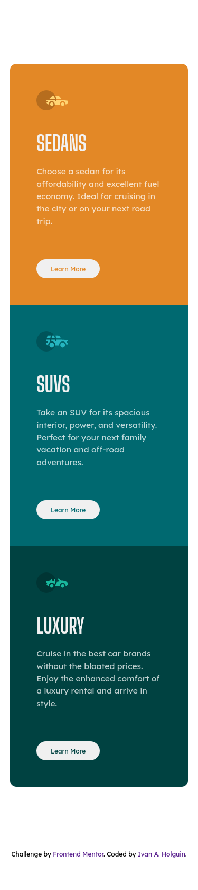

# Frontend Mentor - 3-column preview card component solution

This is a solution to the [3-column preview card component challenge on Frontend Mentor](https://www.frontendmentor.io/challenges/3column-preview-card-component-pH92eAR2-). Frontend Mentor challenges help you improve your coding skills by building realistic projects. 

## Table of contents

- [Overview](#overview)
  - [The challenge](#the-challenge)
  - [Screenshot](#screenshot)
  - [Links](#links)
- [My process](#my-process)
  - [Built with](#built-with)
  - [What I learned](#what-i-learned)
- [Author](#author)

## Overview

### The challenge

Users should be able to:

- View the optimal layout depending on their device's screen size
- See hover states for interactive elements

### Screenshot

Mobile

Desktop

### Links

- Solution URL: [Solution](https://www.frontendmentor.io/solutions/3column-preview-card-component-using-html-css-and-flexbox-0QvTlz_4k)
- Live Site URL: [GitHub Pages](https://ascecent.github.io/FrontEnd-Mentor-Challenge-3-column-preview-card-component/)

## My process

### Built with

- Semantic HTML5 markup
- CSS custom properties
- Normalize CSS
- Flexbox
- Web responsive workflow

### What I learned

I've improved my skills using media queries and flexbox, also using relative lenghts like rem and vw :D

## Author

- Name: Ivan A. Holguin
- Frontend Mentor - [@Ascecent](https://www.frontendmentor.io/profile/Ascecent)
- LinkedIn - [@Ivan Holguin](https://www.linkedin.com/in/iv%C3%A1n-holgu%C3%ADn-7bb86a211/)

